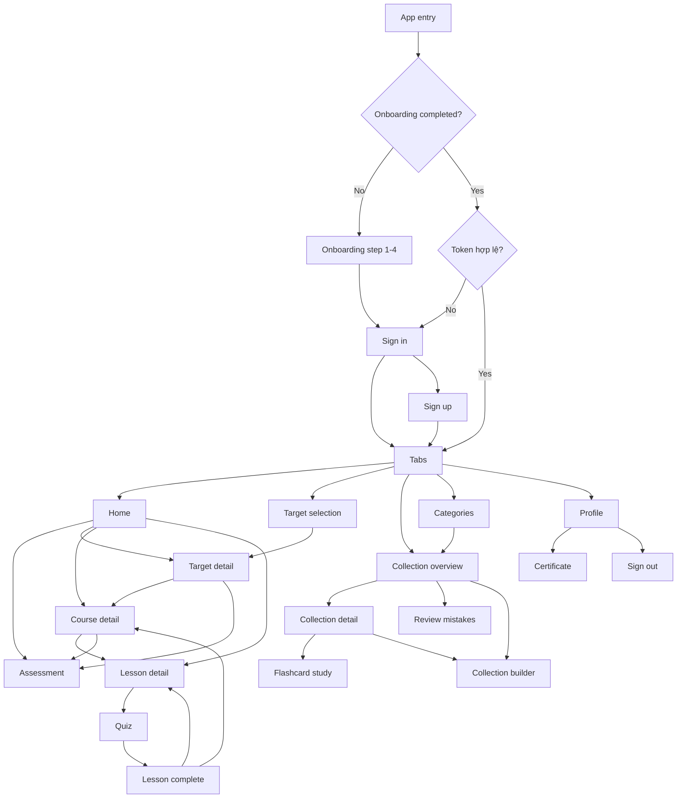

# User Flow

## Tổng quan
`workflow.md` mô tả **user flow thực tế đang chạy** trong mobile app sau khi đã nối backend, auth, progress và seed MongoDB.

- Core learning content không còn đọc `mock-content.ts`.
- App có auth thật, token lưu bằng `expo-secure-store`.
- Một số utility node ngoài core scope vẫn giữ `coming-soon`.

## Flow tổng quan

## Onboarding & Auth

### 1. App entry
- Route: `/`
- Hành vi:
  - chưa hoàn thành onboarding → `/(auth)/onboarding-step-1`
  - đã onboarding nhưng chưa đăng nhập → `/(auth)/sign-in`
  - đã có token hợp lệ → `/(tabs)`

### 2. Onboarding
- `/(auth)/onboarding-step-1..4`
- Thu thập thông tin cài đặt ban đầu.
- Step 4 gọi `completeOnboarding()` rồi chuyển sang `sign-in`.

### 3. Sign in / Sign up
- `/(auth)/sign-in`
  - gọi `POST /api/v1/auth/login`
  - lưu token vào secure storage
  - chuyển vào `/(tabs)`
- `/(auth)/sign-up`
  - gọi `POST /api/v1/auth/register`
  - lưu token
  - chuyển thẳng vào `/(tabs)`

## Learning Flow

### 1. Home
- Route: `/(tabs)/index`
- Dữ liệu:
  - `GET /api/v1/targets`
  - `GET /api/v1/courses`
  - `GET /api/v1/lessons?courseId=...`
- Nhánh chính:
  - active course card → `/course?courseId=...`
  - assessment banner → `/assessment?targetType=...`
  - lesson item → `/lesson?lessonId=...`
  - `Xem tất cả` → `/(tabs)/target`

### 2. Target
- `/(tabs)/target`
  - chọn TOEIC / IELTS
  - CTA → `/target?type=...`
- `/target`
  - `GET /api/v1/targets/:type`
  - `GET /api/v1/courses`
  - course card → `/course?courseId=...`
  - assessment card → `/assessment?targetType=...`

### 3. Course
- `/course?courseId=...`
- Dữ liệu:
  - `GET /api/v1/courses/:id`
  - `GET /api/v1/lessons?courseId=...`
- Nhánh chính:
  - lesson item → `/lesson?lessonId=...`
  - locked assessment → `/assessment?targetType=...`
  - CTA `Bắt đầu` → lesson đầu tiên

### 4. Lesson
- `/lesson?lessonId=...`
- Dữ liệu:
  - `GET /api/v1/lessons/:id`
  - `GET /api/v1/vocabulary?lessonId=...`
  - `GET /api/v1/quiz?lessonId=...`
  - `POST /api/v1/progress/lesson-access`
- CTA `Làm quiz` bật flow quiz trong cùng route.

### 5. Quiz
- Chạy trong state nội bộ của `/lesson`.
- Khi hoàn tất:
  - gọi `POST /api/v1/quiz/submit`
  - backend lưu `quiz_attempt` + cập nhật `user_progress`
  - mobile chuyển sang `/lesson-complete`

### 6. Lesson complete
- `/lesson-complete`
- Hiển thị score, XP earned.
- CTA:
  - trở về lesson
  - quay lại course

### 7. Assessment
- `/assessment?targetType=toeic|ielts`
- Dữ liệu:
  - `GET /api/v1/assessments/:targetType`
  - `POST /api/v1/assessments/submit`
- Kết quả trả về `recommendedCourseId`, CTA đi thẳng vào course gợi ý.

## Library Flow

### 1. Collection overview
- `/(tabs)/collection`
- Dữ liệu:
  - `GET /api/v1/collections`
- Nhánh chính:
  - `Ôn tập lỗi sai` → `/review-mistakes`
  - `Tạo thư mục` → `/collection-builder`
  - collection card → `/(tabs)/collection?collectionId=...`
  - `Học ngẫu nhiên` → `/(tabs)/collection?collectionId=...&mode=study`

### 2. Collection detail
- `/(tabs)/collection?collectionId=...`
- Dữ liệu:
  - `GET /api/v1/collections/:id`
  - `GET /api/v1/collections/:id/flashcards`
- Nhánh chính:
  - `Học bộ thẻ` → `mode=study`
  - `Tạo flashcard` → `/collection-builder?collectionId=...`

### 3. Flashcard study
- `/(tabs)/collection?collectionId=...&mode=study`
- Học theo từng flashcard, lật mặt trước/sau, next/prev.

### 4. Collection builder
- `/collection-builder`
- Hai mode:
  - `Tạo thư mục` → `POST /api/v1/collections`
  - `Tạo flashcard` → `POST /api/v1/collections/:id/flashcards`
- Nếu vào từ detail route có sẵn `collectionId`, app mở thẳng mode tạo flashcard.

### 5. Review mistakes
- `/review-mistakes`
- Dữ liệu:
  - `GET /api/v1/progress/review-mistakes`
- Hiển thị câu đã làm sai, lời giải, và link mở lại bài học.

### 6. Categories
- `/(tabs)/categories`
- Dữ liệu:
  - `GET /api/v1/collections`
- Categories được derive từ collection data.
- Tap category → `/(tabs)/collection?collectionId=...`

## Profile

### 1. Profile
- `/(tabs)/profile`
- Dữ liệu:
  - `GET /api/v1/users/profile`
- Bao gồm:
  - user basics
  - progress snapshot
  - metrics
  - achievements
  - certificates
- CTA:
  - certificate card → `/certificate`
  - sign out → xóa token và quay về sign-in

### 2. Certificate
- `/certificate`
- Dữ liệu lấy từ `GET /api/v1/users/profile`
- Hiển thị tất cả certificate template và trạng thái unlocked.

## Placeholder còn giữ

Các nhánh sau vẫn đi qua `app/coming-soon.tsx` vì ngoài core scope hiện tại:
- Search
- Notifications
- Forgot password
- Google/Facebook/Apple sign-in
- Facebook/Apple link
- Các info CTA phụ như `Thông tin khóa học`, `Thông tin bài học`, `Thông tin mục tiêu`
- Bộ lọc / tùy chọn thể loại phụ

## Route map

| Route | Chức năng | Trạng thái |
|---|---|---|
| `/` | app entry theo onboarding + auth state | active |
| `/(auth)/onboarding-step-1..4` | onboarding flow | active |
| `/(auth)/sign-in` | login thật | active |
| `/(auth)/sign-up` | register thật | active |
| `/(tabs)/index` | home | active |
| `/(tabs)/target` | target selection | active |
| `/target` | target detail | active |
| `/course` | course detail | active |
| `/lesson` | lesson + quiz | active |
| `/lesson-complete` | quiz result screen | active |
| `/assessment` | target assessment | active |
| `/(tabs)/collection` | collection overview/detail/study | active |
| `/collection-builder` | create folder / create flashcard | active |
| `/review-mistakes` | review wrong answers | active |
| `/(tabs)/categories` | categories grid | active |
| `/(tabs)/profile` | profile summary | active |
| `/certificate` | certificate screen | active |
| `/coming-soon` | non-core placeholder | placeholder |
